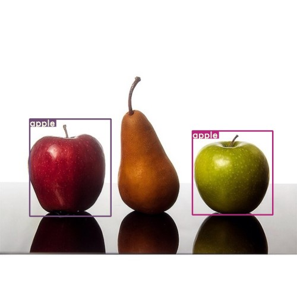
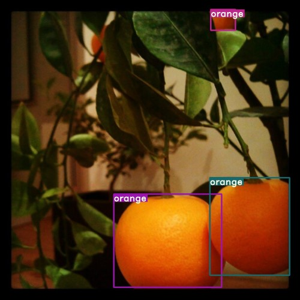
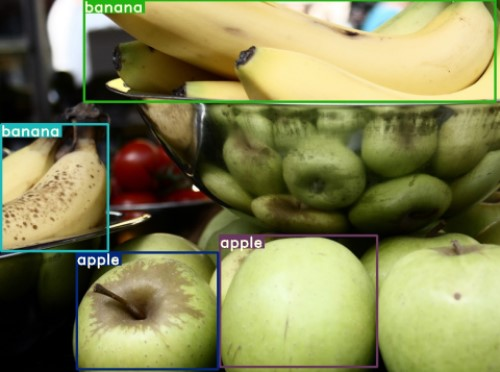

# YOLOv3
PyTorch implementation of YOLOv3 for detecting apples, bananas and oranges in images. Custom weights trained using the 
Open Images dataset.

## Getting Started

Create a virtual environment:

```
python3 -m venv venv
source venv/bin/activate
```

Install requirements:

```
pip3 install -r requirements.txt
```

## Inference
```
python3 detect.py
```

Options (default values below):

* Input images directory: `--images images`
* Output images directory: `--output output`
* Batch size: `--batch 1`
* Object confidence threshold: `--conf_thres 0.3`
* Non-maximum suppression threshold: `--nms_thres 0.6`
* Network configuration file: `--cfg cfg/yolov3-custom.cfg`
* Weights file: `--weights weights/custom.weights`
* Image size: `--img_size 416`







## References

```
@article{yolov3,
  title={YOLOv3: An Incremental Improvement},
  author={Redmon, Joseph and Farhadi, Ali},
  journal = {arXiv},
  year={2018}
}
```

* [How to implement a YOLO (v3) object detector from scratch in PyTorch](https://blog.paperspace.com/how-to-implement-a-yolo-object-detector-in-pytorch/)
* [Yolo V 3 network from scratch in pytorch](https://www.youtube.com/watch?v=lTBFIwSGxrY)
* [PyTorch-YOLOv3](https://github.com/eriklindernoren/PyTorch-YOLOv3)
* [OIDv4 ToolKit](https://github.com/theAIGuysCode/OIDv4_ToolKit)
* [YOLOv3 in PyTorch > ONNX > CoreML > iOS](https://github.com/ultralytics/yolov3/)
